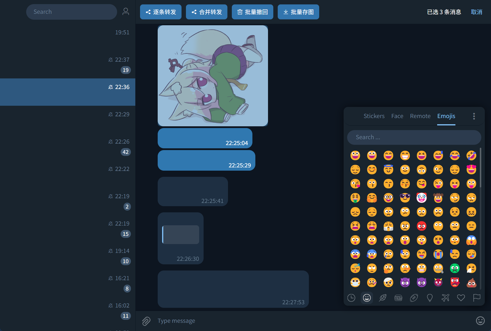

# Patch for Telegram Theme for Icalingua++

一个基于 [Telegram Theme for Icalingua++ v1.0.2](https://github.com/wibus-wee-ac/icalingua-theme-telegram/releases/tag/v1.0.2) 的补丁，使其与 Telegram 进一步一致。

## 安装

> [!warning]
> 与 `fix-message-content-width` 冲突。

在 `sass` 环境下执行 `build.bat`，然后重启 Icalingua++。

## TODO

- [ ] 支持群成员面板。
- [ ] 支持快捷表情面板和 @ 面板。（不好调试）
- [ ] 整理 `color` 和 `mixin` 两块💩山。

我不使用下列功能，所以随缘添加。

- [ ] 支持单面板模式
- [ ] 支持聊天分组
